# 📌 Quản lý nhân sự

## 🚀 Giới thiệu

Dự án Quản lý nhân sự giúp admin quản lý nhân sự một cách hiệu quả. Dự án được xây dựng bằng TypeScript, Node.js, Express và MongoDB, tích hợp Singleton Pattern trong quá trình khởi tạo database.

## Thông tin môi trường phát triển

- Node.js: v20.17.0
- Package Manager: npm 10.8.2
- Express: v5.0.1
- MongoDB: 4.4 (Dockerized)
- Docker: 27.3.1, Docker Compose: v2.30.3-desktop.1

## 📂 Cấu trúc thư mục

```
/hitek-human-resource-management
│── docs/
│   ├── images/         # Những hình ảnh test API
│       ├── authentication
│       ├── employee
│── src/                # Mã nguồn chính
│   ├── config/         # Sử dụng cấu hình
│   ├── controllers/    # Xử lý request
│   ├── core/           # Xử lý response và error
│   ├── db/             # Kết nối MongoDB (Singleton Pattern)
│   ├── middlewares/    # Middleware chung
│   ├── models/         # Mô hình dữ liệu Mongoose
│   ├── repository/     # Truy vấn dữ liệu
│   ├── routes/         # Routes API
│   ├── services/       # Business logic
│   ├── utils/          # Hỗ trợ tổng quát
│   ├── app.ts          # Khởi tạo ứng dụng Express
│   ├── index.ts        # Khởi động server
│── .dockerignore               # Bỏ qua file khi build Docker
│── .editorconfig               # Cấu hình quy tắc format code cho Editor
│── .env                        # Biến môi trường cho ứng dụng
│── .env.example                # Mẫu file .env, hướng dẫn cấu hình biến môi trường
│── .gitignore                  # Bỏ qua file khi commit vào Git
│── .prettierrc                 # Cấu hình Prettier để format code
│── docker-compose.yml          # Chạy dự án với Docker Compose
│── Dockerfile                  # Đóng gói dự án thành Docker image
│── eslint.config.mjs           # Cấu hình ESLint để kiểm tra code
│── nodemon.json                # Cấu hình Nodemon để tự động reload server khi code thay đổi
│── package-lock.json           # Khóa phiên bản dependencies
│── package.json                # Quản lý dependencies và script chạy dự án
│── README.md                   # Tài liệu mô tả và hướng dẫn cách sử dụng dự án
│── tsconfig.json               # Cài đặt TypeScript cho dự án
```

## 📌 Cấu trúc Database

### 🗝️ **Bảng `keys`** (Lưu trữ khóa bảo mật)

| Trường              | Kiểu dữ liệu           | Bắt buộc | Mô tả                                  |
| ------------------- | ---------------------- | -------- | -------------------------------------- |
| `_id`               | `ObjectId`             | ✅       | ID của khóa (tự động tạo bởi MongoDB)  |
| `user`              | `ObjectId (ref: Shop)` | ✅       | ID của Shop liên kết với khóa này      |
| `privateKey`        | `String`               | ✅       | Khóa riêng tư                          |
| `publicKey`         | `String`               | ✅       | Khóa công khai                         |
| `refreshTokensUsed` | `Array<String>`        | ❌       | Danh sách các refresh token đã sử dụng |
| `refreshToken`      | `String`               | ✅       | Refresh token hiện tại                 |
| `createdAt`         | `Date`                 | ✅       | Thời gian tạo (tự động)                |
| `updatedAt`         | `Date`                 | ✅       | Thời gian cập nhật (tự động)           |

---

### 👤 **Bảng `employees`** (Lưu trữ thông tin nhân sự)

| Trường      | Kiểu dữ liệu                 | Bắt buộc | Mô tả                                      |
| ----------- | ---------------------------- | -------- | ------------------------------------------ |
| `_id`       | `ObjectId`                   | ✅       | ID của nhân viên (tự động tạo bởi MongoDB) |
| `username`  | `String (unique)`            | ✅       | Tên đăng nhập (không trùng lặp)            |
| `fullname`  | `String`                     | ❌       | Họ và tên                                  |
| `password`  | `String`                     | ✅       | Mật khẩu đã hash                           |
| `avatar`    | `String`                     | ❌       | Ảnh đại diện                               |
| `status`    | `Enum('active', 'deactive')` | ✅       | Trạng thái tài khoản (mặc định: `active`)  |
| `createdAt` | `Date`                       | ✅       | Thời gian tạo (tự động)                    |
| `updatedAt` | `Date`                       | ✅       | Thời gian cập nhật (tự động)               |

## 📌 Danh Sách API

### 🛠️ **Xác Thực (Authentication)**

| Phương Thức | Endpoint                            | Mô Tả                                                                                                                                   | Yêu Cầu Header |
| ----------- | ----------------------------------- | --------------------------------------------------------------------------------------------------------------------------------------- | ------------- |
| `POST`      | `/api/v1/auth/register`             | Đăng ký tài khoản mới                                                                                                                   | ❌            |
| `POST`      | `/api/v1/auth/login`                | Đăng nhập                                                                                                                               | ❌            |
| `POST`      | `/api/v1/auth/change-password`      | Thay đổi mật khẩu                                                                                                                       | ✅            |
| `POST`      | `/api/v1/auth/handler-refreshToken` | Xử lý refresh token để cấp token mới khi access token hết hạn, đồng thời kiểm tra bảo mật để tránh các cuộc tấn công sử dụng lại token. | ✅            |

---

### 👤 **Nhân sự (Employees)**

| Phương Thức | Endpoint                | Mô Tả                         | Yêu Cầu Header |
| ----------- | ----------------------- | ----------------------------- | ------------- |
| `GET`       | `/api/v1/employees`     | Lấy danh sách nhân sự         | ✅            |
| `GET`       | `/api/v1/employees/:id` | Lấy thông tin nhân sự theo ID | ✅            |
| `PUT`       | `/api/v1/employees/:id` | Cập nhật thông tin nhân sự    | ✅            |
| `DELETE`    | `/api/v1/employees/:id` | Xóa nhân sự                   | ✅            |

### 📌 Các tham số Header của API
```sh
x-client-id: <userId>
authorization: <accessToken>
x-rtoken-id: <refreshToken>
```
**Riêng `/api/v1/auth/handler-refreshToken` cần `x-client-id`, `authorization`, `x-rtoken-id`.**  
**Còn lại, những API nào yêu cầu Header thì cần `x-client-id`, `authorization`.**

# 📸 Kiểm Tra API (Test API)

Để kiểm tra các API của dự án, bạn có thể sử dụng **Postman**.

## Sử Dụng Postman

### 🔐 **Authentication**

**1. Register**

**Request Body:**  
 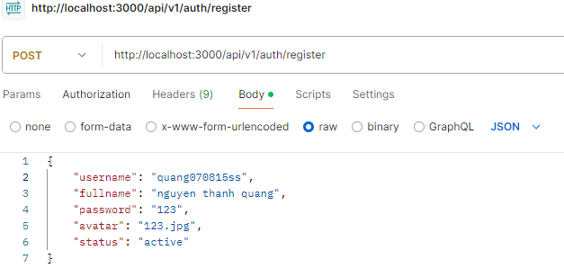

**Response:**  
 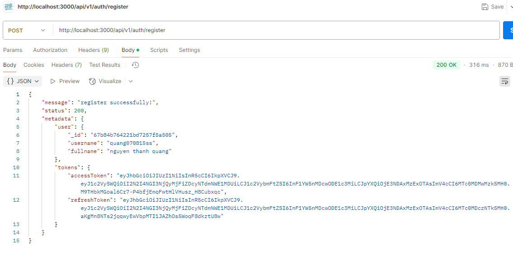

**2. Login**

**Request Body:**  
 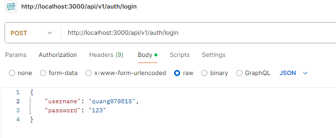

**Response:**  
 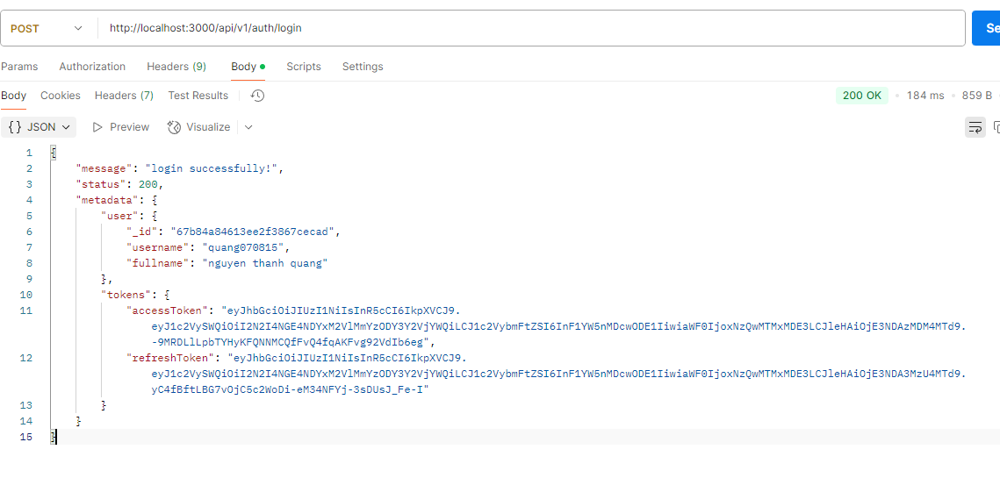

**3. Change password**

**Request Body and Response:**  
 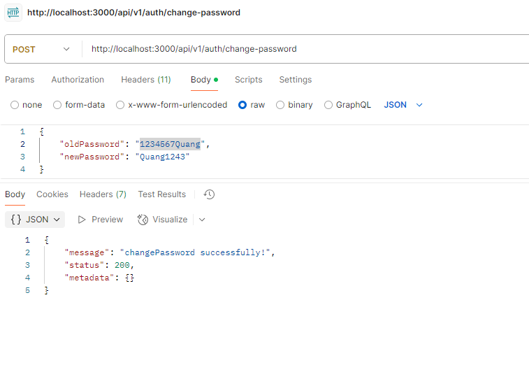

**4. Handle Refresh Token**

**Request Header:**  
 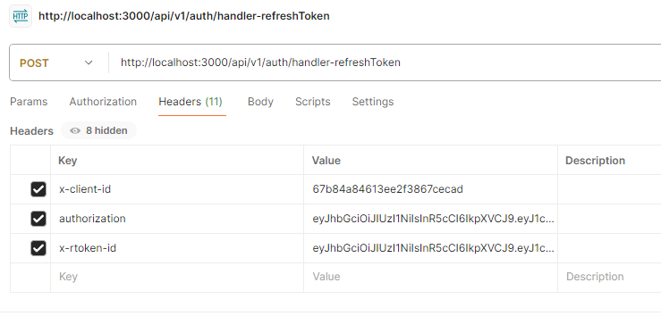

**Response:**  
 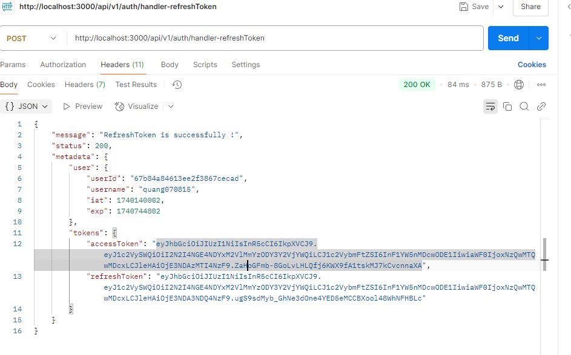

**Error if reusing Token:**
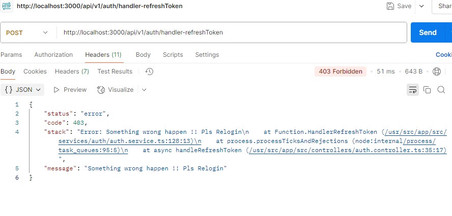

---

**👥 Employees**

**5. Get employees by Id**

**Request Header and Response:**  
 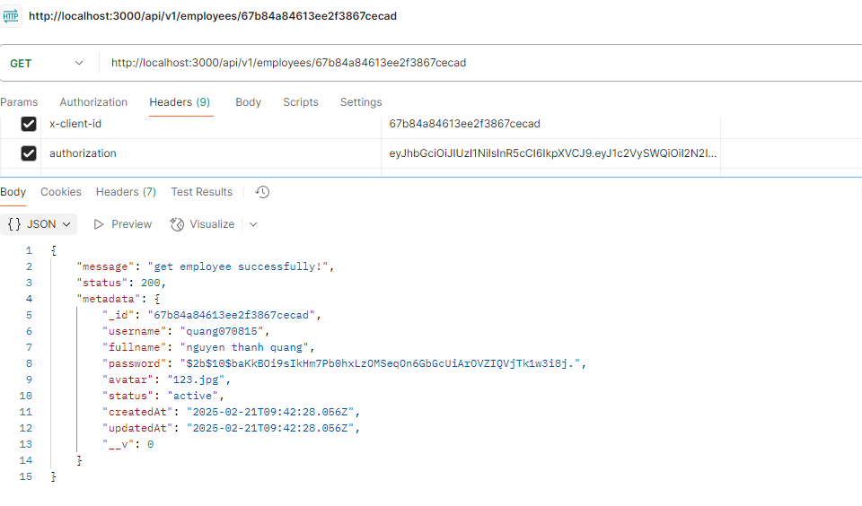

**6. Get all employees**

**Request Header:**  
 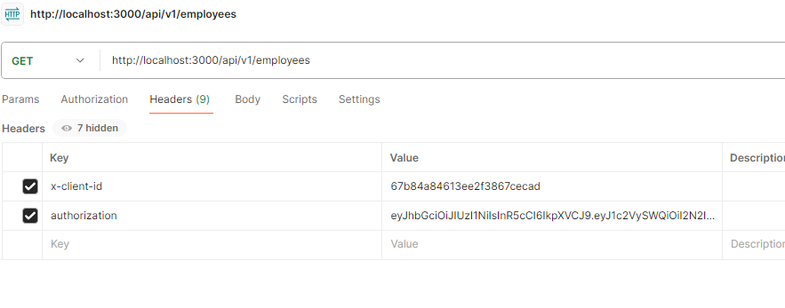

**Response:**  
 

**7. Update employees**

**Request Header:**  
 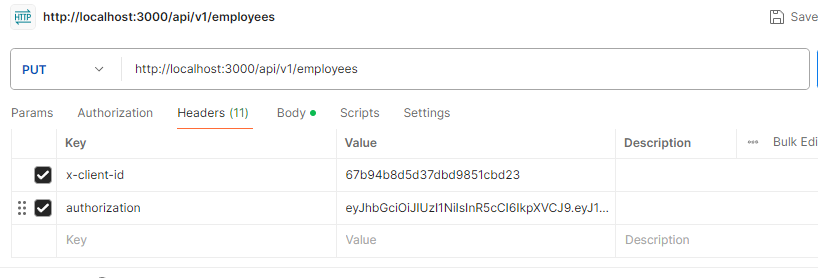

**Body and Response:**  
 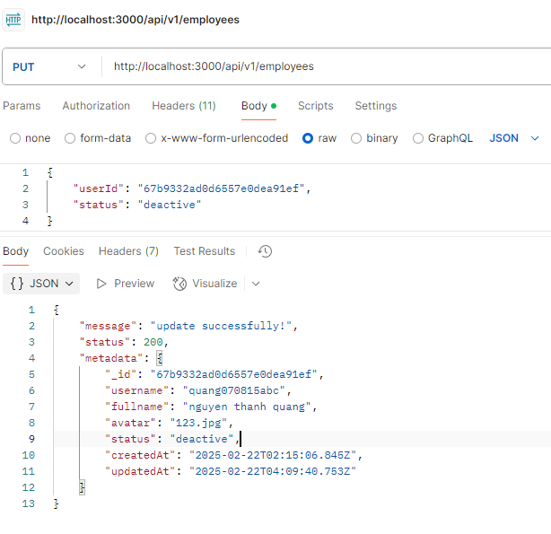

**8. Delete employees**

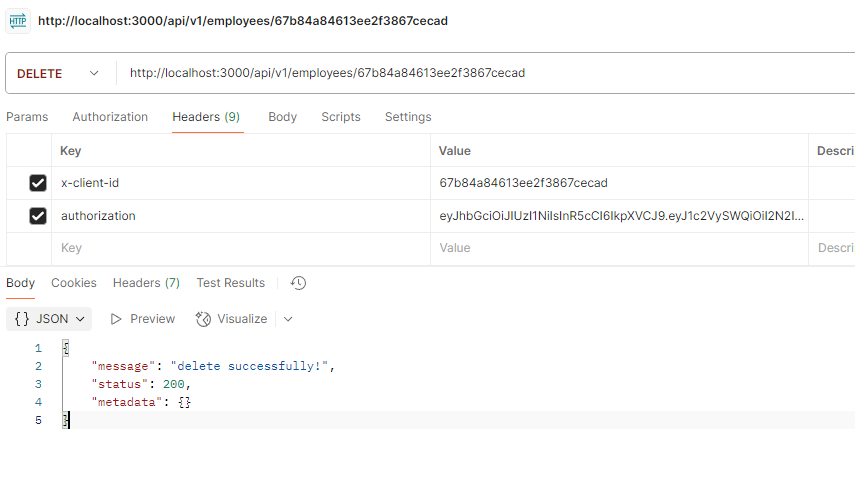

## Hướng dẫn sử dụng (build và deploy)

1. **Clone repo**

2. **Cài đặt Docker và Docker Compose**

### Chạy bằng Docker

3. **Thêm file .env như trong env.example**

4. **Xây dựng và chạy container**

```sh
docker-compose up --build -d
```

4. **Kiểm tra container**

```sh
docker ps
```

5. **Truy cập API**

```sh
Ví dụ:
http://localhost:3000/api/employees (Lưu ý: api này này cần header(x-client-id, authorization) từ đăng nhập)
```

6. **Dừng container**

```sh
docker-compose down
```

## Singleton Pattern trong khởi tạo MongoDB

Dự án áp dụng Singleton Pattern trong việc kết nối MongoDB nhằm tránh tình trạng tạo nhiều kết nối không cần thiết

## Các tính năng

### Đã làm:

- [x] Quản lý nhân sự(Xem tất cả, xem chi tiết, xóa, chỉnh sửa nhân sự )
- [x] Authentication(Đăng kí, đăng nhập, thay đổi mật khẩu)
- [x] Xác thực JWT bảo vệ router và tạo JWT sử dụng thuật toán đối xứng ngoài ra có cấp cặp Token mới khi hết hạn và ngăn chặn tấn công sử dụng lại token
- [x] Xử lý lỗi(Thành công, Thất bại, Ngoại lệ)
- [x] Kết nối MongoDB theo Singleton Pattern
- [x] Dockerized backend + MongoDB sử dụng docker và docker-compose

### Chưa làm: Không có